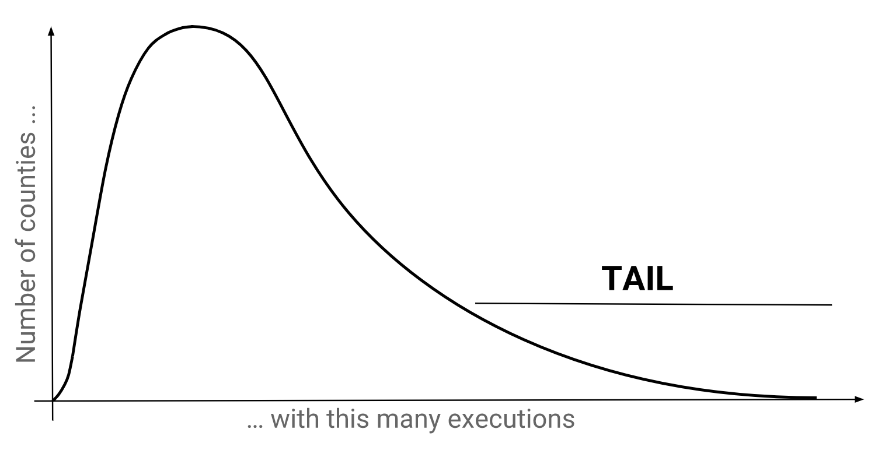

# Select Star SQL - The Long Tail

## Goal
Learning concepts like `Long tails`, `Nesting` and 
`GROUP BY ... HAVING ... ORDER BY` blocks.

## Main ideas
- `Long tails` refer to small number of samples which occur a large number of times.
- They indicate the presence of outliers whose unusual behaviours may be of interest to us.

- `GROUP BY <column>, <column>, ...` and comes after the `WHERE` block.
- Filtering via the `WHERE` block happens `before` grouping and aggregation.
- We can use `HAVING` when we want to filter `after` grouping or aggregating.

``` sql
SELECT
  county,
  COUNT(*) AS county_executions
FROM executions
GROUP BY county
```
```sql
ORDER BY <column>, <column>, ...
/* It can be modified by appending DESC if one doesn't want the default ascending order */
```

## Fun things to know
- Example of technique called `nesting`.
- Here one query aggregates with `GROUP BY` and the other doesn't.
``` sql
SELECT first_name, last_name
FROM executions
WHERE LENGTH(last_statement) =
    (SELECT MAX(LENGTH(last_statement))
     FROM executions)
```

## Examples
```sql
SELECT
  county,
  100.0 * COUNT(*) / (SELECT COUNT(*) FROM executions)
    AS percentage
FROM executions
GROUP BY county
ORDER BY percentage DESC
```